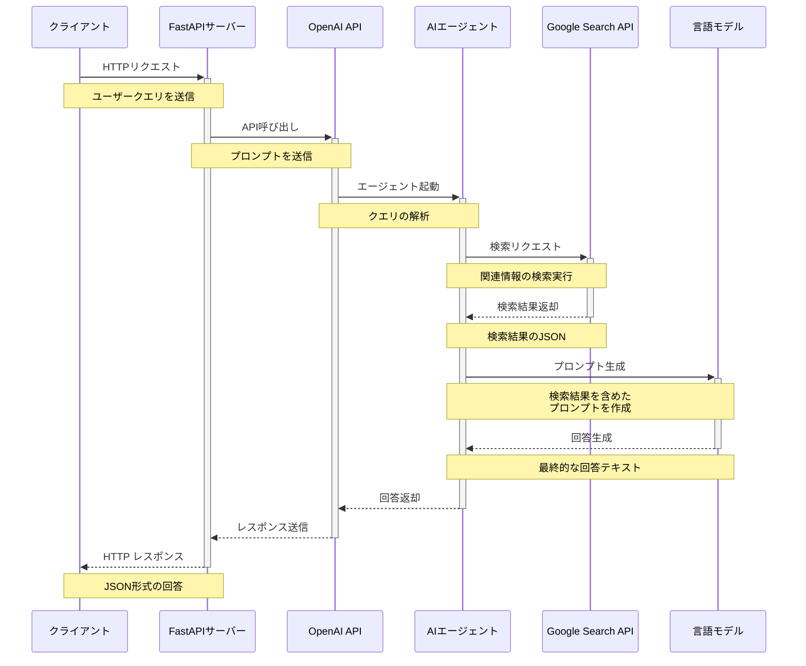

# System Sequence Diagram

```mermaid
sequenceDiagram
    participant Client as クライアント
    participant FastAPI as FastAPIサーバー
    participant OpenAI as OpenAI API
    participant Agent as AIエージェント
    participant Google as Google Search API
    participant LLM as 言語モデル

    Client->>+FastAPI: HTTPリクエスト
    Note over Client,FastAPI: ユーザークエリを送信

    FastAPI->>+OpenAI: API呼び出し
    Note over FastAPI,OpenAI: プロンプトを送信

    OpenAI->>+Agent: エージェント起動
    Note over OpenAI,Agent: クエリの解析

    Agent->>+Google: 検索リクエスト
    Note over Agent,Google: 関連情報の検索実行
    Google-->>-Agent: 検索結果返却
    Note over Google,Agent: 検索結果のJSON

    Agent->>+LLM: プロンプト生成
    Note over Agent,LLM: 検索結果を含めた<br/>プロンプトを作成
    LLM-->>-Agent: 回答生成
    Note over LLM,Agent: 最終的な回答テキスト

    Agent-->>-OpenAI: 回答返却
    OpenAI-->>-FastAPI: レスポンス送信

    FastAPI-->>-Client: HTTP レスポンス
    Note over FastAPI,Client: JSON形式の回答
```
